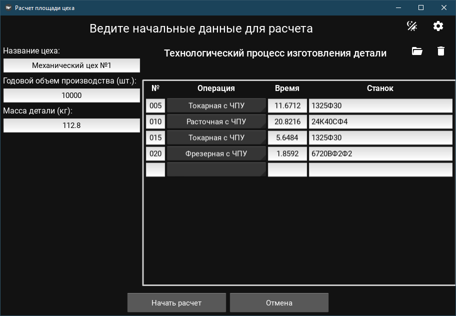
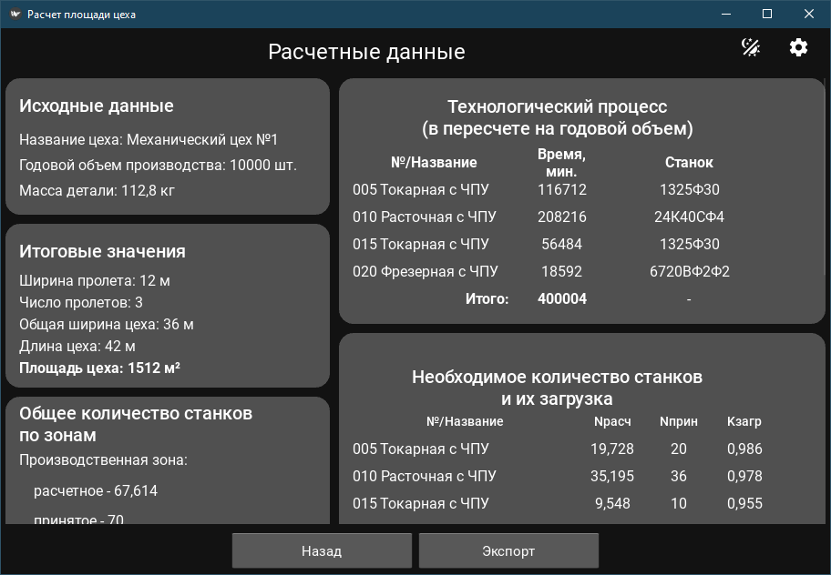
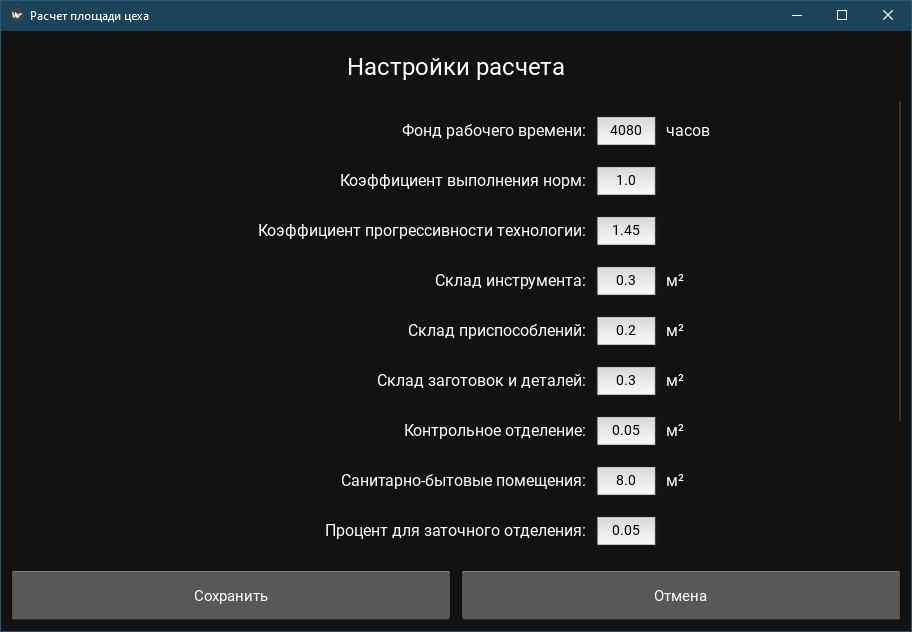

# Design of Mechanical Production

| | |
| --- | --- |
| Testing | [](https://github.com/sad-engineer/design_of_mechanical_production/actions/workflows/python-tests.yml) |


`design_of_mechanical_production` - это пакет Python, содержащий приложение по расчету площади цеха.
Приложение запускается в выбранном режиме (GUI или консольном).

## Установка

### Вариант 1: Poetry (рекомендуется)
```bash
poetry add git+https://github.com/sad-engineer/design_of_mechanical_production.git
```

### Вариант 2: pip
```bash
pip install git+https://github.com/sad-engineer/design_of_mechanical_production.git
```

### Установите зависимости:
```bash
poetry install
```

## Подготовка базы данных станков

При расчетах проект использует базу данных станков. 
База данных содержится в пакете machine_tools, который устанавливается при установке зависимостей. 
Но перед использованием, необходимо инициализировать эту базу.

### Настройка PostgreSQL

1. Установите PostgreSQL, если еще не установлен:
   - Windows: скачайте установщик с [официального сайта](https://www.postgresql.org/download/windows/)
   - Linux: `sudo apt-get install postgresql`
   - Mac: `brew install postgresql`

### Устанавливаем базу данных 

```bash
machine_tools init
```

## Управление режимом запуска

### Команды для управления режимом запуска

Для управления режимом запуска приложения используйте скрипт `launch_manager.py`:

```bash
# Показать текущие настройки запуска
python -m design_of_mechanical_production.launch_manager show

# Установить режим GUI
python -m design_of_mechanical_production.launch_manager gui

# Установить консольный режим
python -m design_of_mechanical_production.launch_manager console

# Установить светлую тему
python -m design_of_mechanical_production.launch_manager theme light

# Установить темную тему
python -m design_of_mechanical_production.launch_manager theme dark
```

### Запуск приложения

После настройки режима запустите приложение:

```bash
python -m design_of_mechanical_production run
```
В зависимости от выбранного варианта работы запустится консольный режим или режим с графической оболочкой.

#### Консольный режим
```
Запуск в консольном режиме...
Файл с начальными данными уже существует: E:\Documents\Программирование\design_of_mechanical_production\input\initial_data.xlsx
Пожалуйста, проверьте и при необходимости отредактируйте данные в файле E:\Documents\Программирование\design_of_mechanical_production\input\initial_data.xlsx.
После завершения редактирования нажмите Enter для продолжения...
```
В рабочей директории в папке input появится файл initial_data.xlsx, в котором находится таблица начальных данных и таблица технологического процесса.
Файл содержит дефолтные данные для быстрого запуска демонстрации. 
Пользователь должен откорректировать файл (обе таблицы) и сохранить его.

После этого, вернуться в консоль и нажать Enter.
``` 
Отчет успешно сгенерирован и сохранен в "work directory"\output\report.txt
```
Отчет будет выгружен в папку output (файл "report.txt")

#### Режим графической оболочки

В окне ввода начальных условий задаются параметры расчета, загружается техпроцесс



Кнопка "Начать расчет" выполнит расчет и представит его в окне вывода результатов



После этого, можно выгрузить отчет о расчете, или вернуться к предыдущему шагу
Оба окна позволяют перейти в окно настроек расчета.



Отчет будет выгружен в папку output (файл "report.txt")

Также, оба главных окна содержат кнопку изменения темы.

## Структура проекта
```
design_of_mechanical_production
└---core
    └---entities
        └---area_calculator.py
        └---equipment.py
        └---machine_info.py
        └---operation.py
        └---process.py
        └---workshop.py
        └---workshop_zone.py
    └---factories
        └---equipment_factory.py
        └---workshop_zone_factory.py
    └---interfaces
        └---i_area_calculator.py
        └---i_data_reader.py
        └---i_equipment.py
        └---i_equipment_factory.py
        └---i_formatters.py
        └---i_machine_info.py
        └---i_operation.py
        └---i_process.py
        └---i_report_generator.py
        └---i_workshop.py
        └---i_workshop_zone.py
    └---services
        └---operation_creator.py
        └---process_creator.py
        └---validation.py
        └---workshop_creator.py
└---data
    └---input
        └---create_initial_data.py
        └---excel_reader.py
    └---output
        └---formatters.py
        └---text_report.py
    └---utils
        └---file_system.py
└---gui
    └---components
        └---config.py
        └---customized_spinner.py
        └---customized_spinner_option.py
        └---customized_text_input.py
        └---event_manager.py
        └---interfaces.py
        └---machine_tool_suggest_field.py
        └---notification_window.py
        └---row_factory.py
        └---table.py
        └---table_row.py
    └---windows
        └---input_window.py
        └---result_window.py
        └---settings_window.py
        └---template_window.py
    └---app.py
└---settings
    └---manager.py
└---utils
    └---machines
        └---finder.py
        └---machine_map.py
        └---machine_tool_operation_map.py
└---launcher.py
└---launch_manager.py
└---__main__.py
docs
input
└---initial_data.xlsx
output
└---report.txt
settings
└---designer_of_mp_config.yaml
└---design_launcher_config.json
└---machine_tools.env
tests
└---core
    └---entities
        └---test_area_calculator.py
        └---test_equipment.py
        └---test_machine_info.py
        └---test_operation.py
        └---test_process.py
        └---test_workshop.py
        └---test_workshop_zone.py
    └---factories
    └---services
        └---test_operation_creator.py
        └---test_process_creator.py
        └---test_validation.py
        └---test_workshop_creator.py
└---utils
pytest.ini
README.md
requirements.txt
setup.cfg
```
